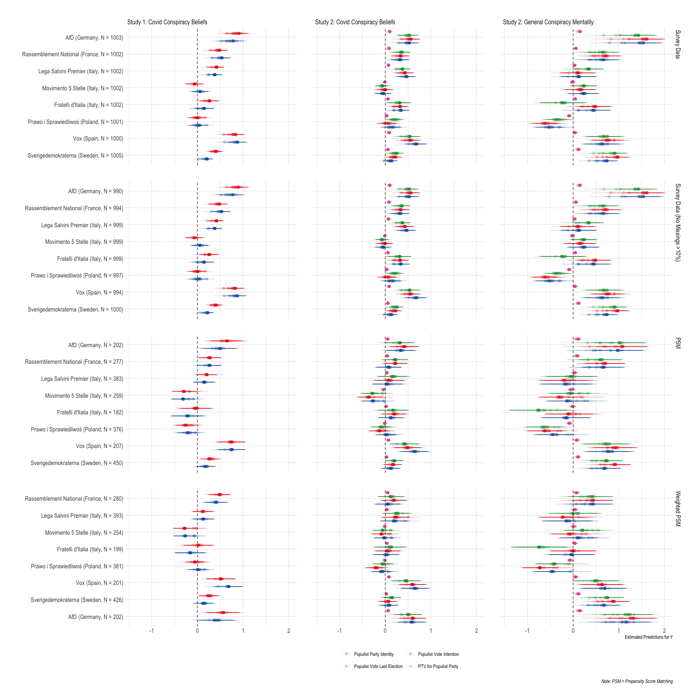

Data Analysis
================

-   <a
    href="#h1-voterssupporters-of-populist-parties-and-extremist-parties-will-be-more-prone-to-a-conspiracy-mentality-than-voterssupporters-of-systemmainstream-parties"
    id="toc-h1-voterssupporters-of-populist-parties-and-extremist-parties-will-be-more-prone-to-a-conspiracy-mentality-than-voterssupporters-of-systemmainstream-parties">H1:
    Voters/supporters of populist parties and extremist parties will be more
    prone to a conspiracy mentality than voters/supporters of
    system/mainstream parties</a>
    -   <a href="#main-independent-variables"
        id="toc-main-independent-variables">Main Independent Variables</a>
-   <a
    href="#h2-voters-that-see-more-distance-between-themselves-and-the-incumbent-government-partyparties-are-more-likely-to-believe-in-conspiracies-than-voters-that-position-themselves-closer-to-the-incumbents"
    id="toc-h2-voters-that-see-more-distance-between-themselves-and-the-incumbent-government-partyparties-are-more-likely-to-believe-in-conspiracies-than-voters-that-position-themselves-closer-to-the-incumbents">H2:
    Voters that see more distance between themselves and the incumbent
    government party/parties are more likely to believe in conspiracies than
    voters that position themselves closer to the incumbent(s)</a>
    -   <a href="#main-independent-variables-1"
        id="toc-main-independent-variables-1">Main Independent Variables</a>

## H1: Voters/supporters of populist parties and extremist parties will be more prone to a conspiracy mentality than voters/supporters of system/mainstream parties

### Main Independent Variables

-   Populist Party Identity: *Do you consider yourself to be close to
    any particular party? If so, which party do you feel close to?* AfD
    (DE), FN (FR), Ln, M5S, FdI (IT), PiS (PL), Vox (SP), SD (SW)
    selected == `1`, otherwise `0`;
-   Populist Vote Last Election: Voted last national elections for AfD
    (DE), FN (FR), Ln, M5S, FdI (IT), PiS (PL), Vox (SP), SD (SW) ==
    `1`, otherwise `0`;
-   Populist Vote Intention: Vote if elections were held tomorrow for
    AfD (DE), FN (FR), Ln, M5S, FdI (IT), PiS (PL), Vox (SP), SD (SW) ==
    `1`, otherwise `0`;
-   PTV for Populist Party: PTV scores for AfD (DE), FN (FR), Ln, M5S,
    FdI (IT), PiS (PL), Vox (SP), SD (SW)

Models where the data does not support the hypothesis:

-   S1 France: hypothesis is not supported in `11%` of the models,
    hypothesis is not supported if `trust_index` was **not** included

-   S1 Germany:hypothesis is not supported in `8%` of the models,
    hypothesis is not supported if `trust_index` was **not** included
    when main independent variable is `populist party id`

-   S1 Poland: hypothesis is not supported in `76%` of the models – no
    pattern for significant/ not significant models

-   S1 Sweden: hypothesis is not supported in `51%` of the models – no
    pattern for significant/ not significant models

-   S2 France Covid: hypothesis is not supported in `61%` of the models
    – significant for the models from “raw” survey data; i.e. no
    matching applied, no weights

-   S2 Germany Covid: hypothesis is not supported in `2%` of the models,
    hypothesis is not supported if matching is applied and all controls
    are added

-   S2 Italy Covid: hypothesis is not supported in `17%` of the models,
    hypothesis is not supported if matching is applied and independent
    variable is `populist vote recall`

-   S2 Poland Covid: hypothesis is not supported in `83%` of the models
    – only significant for models where matching is **not** applied

-   S2 Spain Covid: hypothesis is not supported in `2%` of the models,
    hypothesis is not supported if matching is applied and all controls
    are added

-   S2 Sweden Covid: hypothesis is not supported in `51%` of the models
    – mostly insignificant when matching is applied

-   S2 France PICOM: hypothesis is not supported in `13%` of the models,
    hypothesis is not supported if matching is applied

-   S2 Italy PICOM: hypothesis is not supported in `75%` of the models,
    hypothesis is not supported if matching is applied

-   S2 Poland PICOM: hypothesis is not supported in `13%` of the models
    – not significant for some of the models where matching is not
    applied, but not a real pattern

-   S2 Spain PICOM: hypothesis is not supported in `31%` of the models –
    mostly insignificant when matching and no weighting is applied

-   S2 Sweden PICOM: hypothesis is not supported in `<1%` of the models
    – only insignificant for matched unweighted data where independent
    variable is `populist party id` and all controls are included

<table class="table" style="width: auto !important; margin-left: auto; margin-right: auto;">
<caption>
Frequency Table Significant Models H1
</caption>
<thead>
<tr>
<th style="text-align:left;position: sticky; top:0; background-color: #FFFFFF;">
Country
</th>
<th style="text-align:right;position: sticky; top:0; background-color: #FFFFFF;">
Not Statistically Significant
</th>
<th style="text-align:right;position: sticky; top:0; background-color: #FFFFFF;">
Statistically Significant
</th>
<th style="text-align:left;position: sticky; top:0; background-color: #FFFFFF;">
Study
</th>
</tr>
</thead>
<tbody>
<tr>
<td style="text-align:left;width: 1cm; ">
Sverigedemokraterna (Sweden, N = 450)
</td>
<td style="text-align:right;width: 3cm; ">
10
</td>
<td style="text-align:right;width: 3cm; ">
20
</td>
<td style="text-align:left;width: 3cm; ">
Study 1: Covid Conspiracy Beliefs
</td>
</tr>
<tr>
<td style="text-align:left;width: 1cm; ">
Vox (Spain, N = 207)
</td>
<td style="text-align:right;width: 3cm; ">
0
</td>
<td style="text-align:right;width: 3cm; ">
30
</td>
<td style="text-align:left;width: 3cm; ">
Study 1: Covid Conspiracy Beliefs
</td>
</tr>
<tr>
<td style="text-align:left;width: 1cm; ">
Prawo i Sprawiedliwoś (Poland, N = 376)
</td>
<td style="text-align:right;width: 3cm; ">
15
</td>
<td style="text-align:right;width: 3cm; ">
15
</td>
<td style="text-align:left;width: 3cm; ">
Study 1: Covid Conspiracy Beliefs
</td>
</tr>
<tr>
<td style="text-align:left;width: 1cm; ">
Fratelli d’Italia (Italy, N = 182)
</td>
<td style="text-align:right;width: 3cm; ">
30
</td>
<td style="text-align:right;width: 3cm; ">
NA
</td>
<td style="text-align:left;width: 3cm; ">
Study 1: Covid Conspiracy Beliefs
</td>
</tr>
<tr>
<td style="text-align:left;width: 1cm; ">
Movimento 5 Stelle (Italy, N = 259)
</td>
<td style="text-align:right;width: 3cm; ">
6
</td>
<td style="text-align:right;width: 3cm; ">
24
</td>
<td style="text-align:left;width: 3cm; ">
Study 1: Covid Conspiracy Beliefs
</td>
</tr>
<tr>
<td style="text-align:left;width: 1cm; ">
Lega Salvini Premier (Italy, N = 383)
</td>
<td style="text-align:right;width: 3cm; ">
30
</td>
<td style="text-align:right;width: 3cm; ">
NA
</td>
<td style="text-align:left;width: 3cm; ">
Study 1: Covid Conspiracy Beliefs
</td>
</tr>
<tr>
<td style="text-align:left;width: 1cm; ">
Rassemblement National (France, N = 277)
</td>
<td style="text-align:right;width: 3cm; ">
7
</td>
<td style="text-align:right;width: 3cm; ">
23
</td>
<td style="text-align:left;width: 3cm; ">
Study 1: Covid Conspiracy Beliefs
</td>
</tr>
<tr>
<td style="text-align:left;width: 1cm; ">
AfD (Germany, N = 202)
</td>
<td style="text-align:right;width: 3cm; ">
5
</td>
<td style="text-align:right;width: 3cm; ">
55
</td>
<td style="text-align:left;width: 3cm; ">
Study 1: Covid Conspiracy Beliefs
</td>
</tr>
<tr>
<td style="text-align:left;width: 1cm; ">
Support for …
</td>
<td style="text-align:right;width: 3cm; ">
6
</td>
<td style="text-align:right;width: 3cm; ">
114
</td>
<td style="text-align:left;width: 3cm; ">
Study 1: Covid Conspiracy Beliefs
</td>
</tr>
<tr>
<td style="text-align:left;width: 1cm; ">
Sverigedemokraterna (Sweden, N = 426)
</td>
<td style="text-align:right;width: 3cm; ">
15
</td>
<td style="text-align:right;width: 3cm; ">
15
</td>
<td style="text-align:left;width: 3cm; ">
Study 1: Covid Conspiracy Beliefs
</td>
</tr>
<tr>
<td style="text-align:left;width: 1cm; ">
Vox (Spain, N = 201)
</td>
<td style="text-align:right;width: 3cm; ">
0
</td>
<td style="text-align:right;width: 3cm; ">
30
</td>
<td style="text-align:left;width: 3cm; ">
Study 1: Covid Conspiracy Beliefs
</td>
</tr>
<tr>
<td style="text-align:left;width: 1cm; ">
Prawo i Sprawiedliwoś (Poland, N = 381)
</td>
<td style="text-align:right;width: 3cm; ">
30
</td>
<td style="text-align:right;width: 3cm; ">
NA
</td>
<td style="text-align:left;width: 3cm; ">
Study 1: Covid Conspiracy Beliefs
</td>
</tr>
<tr>
<td style="text-align:left;width: 1cm; ">
Fratelli d’Italia (Italy, N = 199)
</td>
<td style="text-align:right;width: 3cm; ">
30
</td>
<td style="text-align:right;width: 3cm; ">
NA
</td>
<td style="text-align:left;width: 3cm; ">
Study 1: Covid Conspiracy Beliefs
</td>
</tr>
<tr>
<td style="text-align:left;width: 1cm; ">
Movimento 5 Stelle (Italy, N = 254)
</td>
<td style="text-align:right;width: 3cm; ">
6
</td>
<td style="text-align:right;width: 3cm; ">
24
</td>
<td style="text-align:left;width: 3cm; ">
Study 1: Covid Conspiracy Beliefs
</td>
</tr>
<tr>
<td style="text-align:left;width: 1cm; ">
Lega Salvini Premier (Italy, N = 393)
</td>
<td style="text-align:right;width: 3cm; ">
30
</td>
<td style="text-align:right;width: 3cm; ">
NA
</td>
<td style="text-align:left;width: 3cm; ">
Study 1: Covid Conspiracy Beliefs
</td>
</tr>
<tr>
<td style="text-align:left;width: 1cm; ">
Rassemblement National (France, N = 280)
</td>
<td style="text-align:right;width: 3cm; ">
0
</td>
<td style="text-align:right;width: 3cm; ">
30
</td>
<td style="text-align:left;width: 3cm; ">
Study 1: Covid Conspiracy Beliefs
</td>
</tr>
<tr>
<td style="text-align:left;width: 1cm; ">
Sverigedemokraterna (Sweden, N = 1005)
</td>
<td style="text-align:right;width: 3cm; ">
1
</td>
<td style="text-align:right;width: 3cm; ">
29
</td>
<td style="text-align:left;width: 3cm; ">
Study 1: Covid Conspiracy Beliefs
</td>
</tr>
<tr>
<td style="text-align:left;width: 1cm; ">
Vox (Spain, N = 1000)
</td>
<td style="text-align:right;width: 3cm; ">
0
</td>
<td style="text-align:right;width: 3cm; ">
30
</td>
<td style="text-align:left;width: 3cm; ">
Study 1: Covid Conspiracy Beliefs
</td>
</tr>
<tr>
<td style="text-align:left;width: 1cm; ">
Prawo i Sprawiedliwoś (Poland, N = 1001)
</td>
<td style="text-align:right;width: 3cm; ">
29
</td>
<td style="text-align:right;width: 3cm; ">
1
</td>
<td style="text-align:left;width: 3cm; ">
Study 1: Covid Conspiracy Beliefs
</td>
</tr>
<tr>
<td style="text-align:left;width: 1cm; ">
Fratelli d’Italia (Italy, N = 1002)
</td>
<td style="text-align:right;width: 3cm; ">
17
</td>
<td style="text-align:right;width: 3cm; ">
13
</td>
<td style="text-align:left;width: 3cm; ">
Study 1: Covid Conspiracy Beliefs
</td>
</tr>
<tr>
<td style="text-align:left;width: 1cm; ">
Movimento 5 Stelle (Italy, N = 1002)
</td>
<td style="text-align:right;width: 3cm; ">
30
</td>
<td style="text-align:right;width: 3cm; ">
NA
</td>
<td style="text-align:left;width: 3cm; ">
Study 1: Covid Conspiracy Beliefs
</td>
</tr>
<tr>
<td style="text-align:left;width: 1cm; ">
Lega Salvini Premier (Italy, N = 1002)
</td>
<td style="text-align:right;width: 3cm; ">
0
</td>
<td style="text-align:right;width: 3cm; ">
30
</td>
<td style="text-align:left;width: 3cm; ">
Study 1: Covid Conspiracy Beliefs
</td>
</tr>
<tr>
<td style="text-align:left;width: 1cm; ">
Rassemblement National (France, N = 1002)
</td>
<td style="text-align:right;width: 3cm; ">
0
</td>
<td style="text-align:right;width: 3cm; ">
30
</td>
<td style="text-align:left;width: 3cm; ">
Study 1: Covid Conspiracy Beliefs
</td>
</tr>
<tr>
<td style="text-align:left;width: 1cm; ">
AfD (Germany, N = 1003)
</td>
<td style="text-align:right;width: 3cm; ">
0
</td>
<td style="text-align:right;width: 3cm; ">
30
</td>
<td style="text-align:left;width: 3cm; ">
Study 1: Covid Conspiracy Beliefs
</td>
</tr>
<tr>
<td style="text-align:left;width: 1cm; ">
Sverigedemokraterna (Sweden, N = 1000)
</td>
<td style="text-align:right;width: 3cm; ">
1
</td>
<td style="text-align:right;width: 3cm; ">
29
</td>
<td style="text-align:left;width: 3cm; ">
Study 1: Covid Conspiracy Beliefs
</td>
</tr>
<tr>
<td style="text-align:left;width: 1cm; ">
Vox (Spain, N = 994)
</td>
<td style="text-align:right;width: 3cm; ">
0
</td>
<td style="text-align:right;width: 3cm; ">
30
</td>
<td style="text-align:left;width: 3cm; ">
Study 1: Covid Conspiracy Beliefs
</td>
</tr>
<tr>
<td style="text-align:left;width: 1cm; ">
Prawo i Sprawiedliwoś (Poland, N = 997)
</td>
<td style="text-align:right;width: 3cm; ">
29
</td>
<td style="text-align:right;width: 3cm; ">
1
</td>
<td style="text-align:left;width: 3cm; ">
Study 1: Covid Conspiracy Beliefs
</td>
</tr>
<tr>
<td style="text-align:left;width: 1cm; ">
Fratelli d’Italia (Italy, N = 999)
</td>
<td style="text-align:right;width: 3cm; ">
17
</td>
<td style="text-align:right;width: 3cm; ">
13
</td>
<td style="text-align:left;width: 3cm; ">
Study 1: Covid Conspiracy Beliefs
</td>
</tr>
<tr>
<td style="text-align:left;width: 1cm; ">
Movimento 5 Stelle (Italy, N = 999)
</td>
<td style="text-align:right;width: 3cm; ">
30
</td>
<td style="text-align:right;width: 3cm; ">
NA
</td>
<td style="text-align:left;width: 3cm; ">
Study 1: Covid Conspiracy Beliefs
</td>
</tr>
<tr>
<td style="text-align:left;width: 1cm; ">
Lega Salvini Premier (Italy, N = 999)
</td>
<td style="text-align:right;width: 3cm; ">
0
</td>
<td style="text-align:right;width: 3cm; ">
30
</td>
<td style="text-align:left;width: 3cm; ">
Study 1: Covid Conspiracy Beliefs
</td>
</tr>
<tr>
<td style="text-align:left;width: 1cm; ">
Rassemblement National (France, N = 994)
</td>
<td style="text-align:right;width: 3cm; ">
0
</td>
<td style="text-align:right;width: 3cm; ">
30
</td>
<td style="text-align:left;width: 3cm; ">
Study 1: Covid Conspiracy Beliefs
</td>
</tr>
<tr>
<td style="text-align:left;width: 1cm; ">
AfD (Germany, N = 990)
</td>
<td style="text-align:right;width: 3cm; ">
0
</td>
<td style="text-align:right;width: 3cm; ">
30
</td>
<td style="text-align:left;width: 3cm; ">
Study 1: Covid Conspiracy Beliefs
</td>
</tr>
<tr>
<td style="text-align:left;width: 1cm; ">
Sverigedemokraterna (Sweden, N = 450)
</td>
<td style="text-align:right;width: 3cm; ">
38
</td>
<td style="text-align:right;width: 3cm; ">
22
</td>
<td style="text-align:left;width: 3cm; ">
Study 2: Covid Conspiracy Beliefs
</td>
</tr>
<tr>
<td style="text-align:left;width: 1cm; ">
Vox (Spain, N = 207)
</td>
<td style="text-align:right;width: 3cm; ">
1
</td>
<td style="text-align:right;width: 3cm; ">
59
</td>
<td style="text-align:left;width: 3cm; ">
Study 2: Covid Conspiracy Beliefs
</td>
</tr>
<tr>
<td style="text-align:left;width: 1cm; ">
Prawo i Sprawiedliwoś (Poland, N = 376)
</td>
<td style="text-align:right;width: 3cm; ">
60
</td>
<td style="text-align:right;width: 3cm; ">
NA
</td>
<td style="text-align:left;width: 3cm; ">
Study 2: Covid Conspiracy Beliefs
</td>
</tr>
<tr>
<td style="text-align:left;width: 1cm; ">
Fratelli d’Italia (Italy, N = 182)
</td>
<td style="text-align:right;width: 3cm; ">
58
</td>
<td style="text-align:right;width: 3cm; ">
2
</td>
<td style="text-align:left;width: 3cm; ">
Study 2: Covid Conspiracy Beliefs
</td>
</tr>
<tr>
<td style="text-align:left;width: 1cm; ">
Movimento 5 Stelle (Italy, N = 259)
</td>
<td style="text-align:right;width: 3cm; ">
13
</td>
<td style="text-align:right;width: 3cm; ">
47
</td>
<td style="text-align:left;width: 3cm; ">
Study 2: Covid Conspiracy Beliefs
</td>
</tr>
<tr>
<td style="text-align:left;width: 1cm; ">
Lega Salvini Premier (Italy, N = 383)
</td>
<td style="text-align:right;width: 3cm; ">
59
</td>
<td style="text-align:right;width: 3cm; ">
1
</td>
<td style="text-align:left;width: 3cm; ">
Study 2: Covid Conspiracy Beliefs
</td>
</tr>
<tr>
<td style="text-align:left;width: 1cm; ">
Rassemblement National (France, N = 277)
</td>
<td style="text-align:right;width: 3cm; ">
46
</td>
<td style="text-align:right;width: 3cm; ">
14
</td>
<td style="text-align:left;width: 3cm; ">
Study 2: Covid Conspiracy Beliefs
</td>
</tr>
<tr>
<td style="text-align:left;width: 1cm; ">
AfD (Germany, N = 202)
</td>
<td style="text-align:right;width: 3cm; ">
8
</td>
<td style="text-align:right;width: 3cm; ">
112
</td>
<td style="text-align:left;width: 3cm; ">
Study 2: Covid Conspiracy Beliefs
</td>
</tr>
<tr>
<td style="text-align:left;width: 1cm; ">
Support for …
</td>
<td style="text-align:right;width: 3cm; ">
2
</td>
<td style="text-align:right;width: 3cm; ">
238
</td>
<td style="text-align:left;width: 3cm; ">
Study 2: Covid Conspiracy Beliefs
</td>
</tr>
<tr>
<td style="text-align:left;width: 1cm; ">
Sverigedemokraterna (Sweden, N = 426)
</td>
<td style="text-align:right;width: 3cm; ">
49
</td>
<td style="text-align:right;width: 3cm; ">
11
</td>
<td style="text-align:left;width: 3cm; ">
Study 2: Covid Conspiracy Beliefs
</td>
</tr>
<tr>
<td style="text-align:left;width: 1cm; ">
Vox (Spain, N = 201)
</td>
<td style="text-align:right;width: 3cm; ">
1
</td>
<td style="text-align:right;width: 3cm; ">
59
</td>
<td style="text-align:left;width: 3cm; ">
Study 2: Covid Conspiracy Beliefs
</td>
</tr>
<tr>
<td style="text-align:left;width: 1cm; ">
Prawo i Sprawiedliwoś (Poland, N = 381)
</td>
<td style="text-align:right;width: 3cm; ">
54
</td>
<td style="text-align:right;width: 3cm; ">
6
</td>
<td style="text-align:left;width: 3cm; ">
Study 2: Covid Conspiracy Beliefs
</td>
</tr>
<tr>
<td style="text-align:left;width: 1cm; ">
Fratelli d’Italia (Italy, N = 199)
</td>
<td style="text-align:right;width: 3cm; ">
49
</td>
<td style="text-align:right;width: 3cm; ">
11
</td>
<td style="text-align:left;width: 3cm; ">
Study 2: Covid Conspiracy Beliefs
</td>
</tr>
<tr>
<td style="text-align:left;width: 1cm; ">
Movimento 5 Stelle (Italy, N = 254)
</td>
<td style="text-align:right;width: 3cm; ">
60
</td>
<td style="text-align:right;width: 3cm; ">
NA
</td>
<td style="text-align:left;width: 3cm; ">
Study 2: Covid Conspiracy Beliefs
</td>
</tr>
<tr>
<td style="text-align:left;width: 1cm; ">
Lega Salvini Premier (Italy, N = 393)
</td>
<td style="text-align:right;width: 3cm; ">
52
</td>
<td style="text-align:right;width: 3cm; ">
8
</td>
<td style="text-align:left;width: 3cm; ">
Study 2: Covid Conspiracy Beliefs
</td>
</tr>
<tr>
<td style="text-align:left;width: 1cm; ">
Rassemblement National (France, N = 280)
</td>
<td style="text-align:right;width: 3cm; ">
46
</td>
<td style="text-align:right;width: 3cm; ">
14
</td>
<td style="text-align:left;width: 3cm; ">
Study 2: Covid Conspiracy Beliefs
</td>
</tr>
<tr>
<td style="text-align:left;width: 1cm; ">
Sverigedemokraterna (Sweden, N = 1005)
</td>
<td style="text-align:right;width: 3cm; ">
13
</td>
<td style="text-align:right;width: 3cm; ">
47
</td>
<td style="text-align:left;width: 3cm; ">
Study 2: Covid Conspiracy Beliefs
</td>
</tr>
<tr>
<td style="text-align:left;width: 1cm; ">
Vox (Spain, N = 1000)
</td>
<td style="text-align:right;width: 3cm; ">
0
</td>
<td style="text-align:right;width: 3cm; ">
60
</td>
<td style="text-align:left;width: 3cm; ">
Study 2: Covid Conspiracy Beliefs
</td>
</tr>
<tr>
<td style="text-align:left;width: 1cm; ">
Prawo i Sprawiedliwoś (Poland, N = 1001)
</td>
<td style="text-align:right;width: 3cm; ">
29
</td>
<td style="text-align:right;width: 3cm; ">
31
</td>
<td style="text-align:left;width: 3cm; ">
Study 2: Covid Conspiracy Beliefs
</td>
</tr>
<tr>
<td style="text-align:left;width: 1cm; ">
Fratelli d’Italia (Italy, N = 1002)
</td>
<td style="text-align:right;width: 3cm; ">
3
</td>
<td style="text-align:right;width: 3cm; ">
57
</td>
<td style="text-align:left;width: 3cm; ">
Study 2: Covid Conspiracy Beliefs
</td>
</tr>
<tr>
<td style="text-align:left;width: 1cm; ">
Movimento 5 Stelle (Italy, N = 1002)
</td>
<td style="text-align:right;width: 3cm; ">
59
</td>
<td style="text-align:right;width: 3cm; ">
1
</td>
<td style="text-align:left;width: 3cm; ">
Study 2: Covid Conspiracy Beliefs
</td>
</tr>
<tr>
<td style="text-align:left;width: 1cm; ">
Lega Salvini Premier (Italy, N = 1002)
</td>
<td style="text-align:right;width: 3cm; ">
0
</td>
<td style="text-align:right;width: 3cm; ">
60
</td>
<td style="text-align:left;width: 3cm; ">
Study 2: Covid Conspiracy Beliefs
</td>
</tr>
<tr>
<td style="text-align:left;width: 1cm; ">
Rassemblement National (France, N = 1002)
</td>
<td style="text-align:right;width: 3cm; ">
0
</td>
<td style="text-align:right;width: 3cm; ">
60
</td>
<td style="text-align:left;width: 3cm; ">
Study 2: Covid Conspiracy Beliefs
</td>
</tr>
<tr>
<td style="text-align:left;width: 1cm; ">
AfD (Germany, N = 1003)
</td>
<td style="text-align:right;width: 3cm; ">
0
</td>
<td style="text-align:right;width: 3cm; ">
60
</td>
<td style="text-align:left;width: 3cm; ">
Study 2: Covid Conspiracy Beliefs
</td>
</tr>
<tr>
<td style="text-align:left;width: 1cm; ">
Sverigedemokraterna (Sweden, N = 1000)
</td>
<td style="text-align:right;width: 3cm; ">
13
</td>
<td style="text-align:right;width: 3cm; ">
47
</td>
<td style="text-align:left;width: 3cm; ">
Study 2: Covid Conspiracy Beliefs
</td>
</tr>
<tr>
<td style="text-align:left;width: 1cm; ">
Vox (Spain, N = 994)
</td>
<td style="text-align:right;width: 3cm; ">
0
</td>
<td style="text-align:right;width: 3cm; ">
60
</td>
<td style="text-align:left;width: 3cm; ">
Study 2: Covid Conspiracy Beliefs
</td>
</tr>
<tr>
<td style="text-align:left;width: 1cm; ">
Prawo i Sprawiedliwoś (Poland, N = 997)
</td>
<td style="text-align:right;width: 3cm; ">
29
</td>
<td style="text-align:right;width: 3cm; ">
31
</td>
<td style="text-align:left;width: 3cm; ">
Study 2: Covid Conspiracy Beliefs
</td>
</tr>
<tr>
<td style="text-align:left;width: 1cm; ">
Fratelli d’Italia (Italy, N = 999)
</td>
<td style="text-align:right;width: 3cm; ">
3
</td>
<td style="text-align:right;width: 3cm; ">
57
</td>
<td style="text-align:left;width: 3cm; ">
Study 2: Covid Conspiracy Beliefs
</td>
</tr>
<tr>
<td style="text-align:left;width: 1cm; ">
Movimento 5 Stelle (Italy, N = 999)
</td>
<td style="text-align:right;width: 3cm; ">
59
</td>
<td style="text-align:right;width: 3cm; ">
1
</td>
<td style="text-align:left;width: 3cm; ">
Study 2: Covid Conspiracy Beliefs
</td>
</tr>
<tr>
<td style="text-align:left;width: 1cm; ">
Lega Salvini Premier (Italy, N = 999)
</td>
<td style="text-align:right;width: 3cm; ">
0
</td>
<td style="text-align:right;width: 3cm; ">
60
</td>
<td style="text-align:left;width: 3cm; ">
Study 2: Covid Conspiracy Beliefs
</td>
</tr>
<tr>
<td style="text-align:left;width: 1cm; ">
Rassemblement National (France, N = 994)
</td>
<td style="text-align:right;width: 3cm; ">
0
</td>
<td style="text-align:right;width: 3cm; ">
60
</td>
<td style="text-align:left;width: 3cm; ">
Study 2: Covid Conspiracy Beliefs
</td>
</tr>
<tr>
<td style="text-align:left;width: 1cm; ">
AfD (Germany, N = 990)
</td>
<td style="text-align:right;width: 3cm; ">
0
</td>
<td style="text-align:right;width: 3cm; ">
60
</td>
<td style="text-align:left;width: 3cm; ">
Study 2: Covid Conspiracy Beliefs
</td>
</tr>
<tr>
<td style="text-align:left;width: 1cm; ">
Sverigedemokraterna (Sweden, N = 450)
</td>
<td style="text-align:right;width: 3cm; ">
0
</td>
<td style="text-align:right;width: 3cm; ">
60
</td>
<td style="text-align:left;width: 3cm; ">
Study 2: General Conspiracy Mentality
</td>
</tr>
<tr>
<td style="text-align:left;width: 1cm; ">
Vox (Spain, N = 207)
</td>
<td style="text-align:right;width: 3cm; ">
0
</td>
<td style="text-align:right;width: 3cm; ">
60
</td>
<td style="text-align:left;width: 3cm; ">
Study 2: General Conspiracy Mentality
</td>
</tr>
<tr>
<td style="text-align:left;width: 1cm; ">
Prawo i Sprawiedliwoś (Poland, N = 376)
</td>
<td style="text-align:right;width: 3cm; ">
11
</td>
<td style="text-align:right;width: 3cm; ">
49
</td>
<td style="text-align:left;width: 3cm; ">
Study 2: General Conspiracy Mentality
</td>
</tr>
<tr>
<td style="text-align:left;width: 1cm; ">
Fratelli d’Italia (Italy, N = 182)
</td>
<td style="text-align:right;width: 3cm; ">
48
</td>
<td style="text-align:right;width: 3cm; ">
12
</td>
<td style="text-align:left;width: 3cm; ">
Study 2: General Conspiracy Mentality
</td>
</tr>
<tr>
<td style="text-align:left;width: 1cm; ">
Movimento 5 Stelle (Italy, N = 259)
</td>
<td style="text-align:right;width: 3cm; ">
52
</td>
<td style="text-align:right;width: 3cm; ">
8
</td>
<td style="text-align:left;width: 3cm; ">
Study 2: General Conspiracy Mentality
</td>
</tr>
<tr>
<td style="text-align:left;width: 1cm; ">
Lega Salvini Premier (Italy, N = 383)
</td>
<td style="text-align:right;width: 3cm; ">
60
</td>
<td style="text-align:right;width: 3cm; ">
NA
</td>
<td style="text-align:left;width: 3cm; ">
Study 2: General Conspiracy Mentality
</td>
</tr>
<tr>
<td style="text-align:left;width: 1cm; ">
Rassemblement National (France, N = 277)
</td>
<td style="text-align:right;width: 3cm; ">
4
</td>
<td style="text-align:right;width: 3cm; ">
56
</td>
<td style="text-align:left;width: 3cm; ">
Study 2: General Conspiracy Mentality
</td>
</tr>
<tr>
<td style="text-align:left;width: 1cm; ">
AfD (Germany, N = 202)
</td>
<td style="text-align:right;width: 3cm; ">
5
</td>
<td style="text-align:right;width: 3cm; ">
115
</td>
<td style="text-align:left;width: 3cm; ">
Study 2: General Conspiracy Mentality
</td>
</tr>
<tr>
<td style="text-align:left;width: 1cm; ">
Support for …
</td>
<td style="text-align:right;width: 3cm; ">
11
</td>
<td style="text-align:right;width: 3cm; ">
229
</td>
<td style="text-align:left;width: 3cm; ">
Study 2: General Conspiracy Mentality
</td>
</tr>
<tr>
<td style="text-align:left;width: 1cm; ">
Sverigedemokraterna (Sweden, N = 426)
</td>
<td style="text-align:right;width: 3cm; ">
1
</td>
<td style="text-align:right;width: 3cm; ">
59
</td>
<td style="text-align:left;width: 3cm; ">
Study 2: General Conspiracy Mentality
</td>
</tr>
<tr>
<td style="text-align:left;width: 1cm; ">
Vox (Spain, N = 201)
</td>
<td style="text-align:right;width: 3cm; ">
18
</td>
<td style="text-align:right;width: 3cm; ">
42
</td>
<td style="text-align:left;width: 3cm; ">
Study 2: General Conspiracy Mentality
</td>
</tr>
<tr>
<td style="text-align:left;width: 1cm; ">
Prawo i Sprawiedliwoś (Poland, N = 381)
</td>
<td style="text-align:right;width: 3cm; ">
9
</td>
<td style="text-align:right;width: 3cm; ">
51
</td>
<td style="text-align:left;width: 3cm; ">
Study 2: General Conspiracy Mentality
</td>
</tr>
<tr>
<td style="text-align:left;width: 1cm; ">
Fratelli d’Italia (Italy, N = 199)
</td>
<td style="text-align:right;width: 3cm; ">
46
</td>
<td style="text-align:right;width: 3cm; ">
14
</td>
<td style="text-align:left;width: 3cm; ">
Study 2: General Conspiracy Mentality
</td>
</tr>
<tr>
<td style="text-align:left;width: 1cm; ">
Movimento 5 Stelle (Italy, N = 254)
</td>
<td style="text-align:right;width: 3cm; ">
57
</td>
<td style="text-align:right;width: 3cm; ">
3
</td>
<td style="text-align:left;width: 3cm; ">
Study 2: General Conspiracy Mentality
</td>
</tr>
<tr>
<td style="text-align:left;width: 1cm; ">
Lega Salvini Premier (Italy, N = 393)
</td>
<td style="text-align:right;width: 3cm; ">
60
</td>
<td style="text-align:right;width: 3cm; ">
NA
</td>
<td style="text-align:left;width: 3cm; ">
Study 2: General Conspiracy Mentality
</td>
</tr>
<tr>
<td style="text-align:left;width: 1cm; ">
Rassemblement National (France, N = 280)
</td>
<td style="text-align:right;width: 3cm; ">
39
</td>
<td style="text-align:right;width: 3cm; ">
21
</td>
<td style="text-align:left;width: 3cm; ">
Study 2: General Conspiracy Mentality
</td>
</tr>
<tr>
<td style="text-align:left;width: 1cm; ">
Sverigedemokraterna (Sweden, N = 1005)
</td>
<td style="text-align:right;width: 3cm; ">
0
</td>
<td style="text-align:right;width: 3cm; ">
60
</td>
<td style="text-align:left;width: 3cm; ">
Study 2: General Conspiracy Mentality
</td>
</tr>
<tr>
<td style="text-align:left;width: 1cm; ">
Vox (Spain, N = 1000)
</td>
<td style="text-align:right;width: 3cm; ">
7
</td>
<td style="text-align:right;width: 3cm; ">
53
</td>
<td style="text-align:left;width: 3cm; ">
Study 2: General Conspiracy Mentality
</td>
</tr>
<tr>
<td style="text-align:left;width: 1cm; ">
Prawo i Sprawiedliwoś (Poland, N = 1001)
</td>
<td style="text-align:right;width: 3cm; ">
1
</td>
<td style="text-align:right;width: 3cm; ">
59
</td>
<td style="text-align:left;width: 3cm; ">
Study 2: General Conspiracy Mentality
</td>
</tr>
<tr>
<td style="text-align:left;width: 1cm; ">
Fratelli d’Italia (Italy, N = 1002)
</td>
<td style="text-align:right;width: 3cm; ">
22
</td>
<td style="text-align:right;width: 3cm; ">
38
</td>
<td style="text-align:left;width: 3cm; ">
Study 2: General Conspiracy Mentality
</td>
</tr>
<tr>
<td style="text-align:left;width: 1cm; ">
Movimento 5 Stelle (Italy, N = 1002)
</td>
<td style="text-align:right;width: 3cm; ">
59
</td>
<td style="text-align:right;width: 3cm; ">
1
</td>
<td style="text-align:left;width: 3cm; ">
Study 2: General Conspiracy Mentality
</td>
</tr>
<tr>
<td style="text-align:left;width: 1cm; ">
Lega Salvini Premier (Italy, N = 1002)
</td>
<td style="text-align:right;width: 3cm; ">
47
</td>
<td style="text-align:right;width: 3cm; ">
13
</td>
<td style="text-align:left;width: 3cm; ">
Study 2: General Conspiracy Mentality
</td>
</tr>
<tr>
<td style="text-align:left;width: 1cm; ">
Rassemblement National (France, N = 1002)
</td>
<td style="text-align:right;width: 3cm; ">
0
</td>
<td style="text-align:right;width: 3cm; ">
60
</td>
<td style="text-align:left;width: 3cm; ">
Study 2: General Conspiracy Mentality
</td>
</tr>
<tr>
<td style="text-align:left;width: 1cm; ">
AfD (Germany, N = 1003)
</td>
<td style="text-align:right;width: 3cm; ">
0
</td>
<td style="text-align:right;width: 3cm; ">
60
</td>
<td style="text-align:left;width: 3cm; ">
Study 2: General Conspiracy Mentality
</td>
</tr>
<tr>
<td style="text-align:left;width: 1cm; ">
Sverigedemokraterna (Sweden, N = 1000)
</td>
<td style="text-align:right;width: 3cm; ">
0
</td>
<td style="text-align:right;width: 3cm; ">
60
</td>
<td style="text-align:left;width: 3cm; ">
Study 2: General Conspiracy Mentality
</td>
</tr>
<tr>
<td style="text-align:left;width: 1cm; ">
Vox (Spain, N = 994)
</td>
<td style="text-align:right;width: 3cm; ">
7
</td>
<td style="text-align:right;width: 3cm; ">
53
</td>
<td style="text-align:left;width: 3cm; ">
Study 2: General Conspiracy Mentality
</td>
</tr>
<tr>
<td style="text-align:left;width: 1cm; ">
Prawo i Sprawiedliwoś (Poland, N = 997)
</td>
<td style="text-align:right;width: 3cm; ">
1
</td>
<td style="text-align:right;width: 3cm; ">
59
</td>
<td style="text-align:left;width: 3cm; ">
Study 2: General Conspiracy Mentality
</td>
</tr>
<tr>
<td style="text-align:left;width: 1cm; ">
Fratelli d’Italia (Italy, N = 999)
</td>
<td style="text-align:right;width: 3cm; ">
22
</td>
<td style="text-align:right;width: 3cm; ">
38
</td>
<td style="text-align:left;width: 3cm; ">
Study 2: General Conspiracy Mentality
</td>
</tr>
<tr>
<td style="text-align:left;width: 1cm; ">
Movimento 5 Stelle (Italy, N = 999)
</td>
<td style="text-align:right;width: 3cm; ">
59
</td>
<td style="text-align:right;width: 3cm; ">
1
</td>
<td style="text-align:left;width: 3cm; ">
Study 2: General Conspiracy Mentality
</td>
</tr>
<tr>
<td style="text-align:left;width: 1cm; ">
Lega Salvini Premier (Italy, N = 999)
</td>
<td style="text-align:right;width: 3cm; ">
47
</td>
<td style="text-align:right;width: 3cm; ">
13
</td>
<td style="text-align:left;width: 3cm; ">
Study 2: General Conspiracy Mentality
</td>
</tr>
<tr>
<td style="text-align:left;width: 1cm; ">
Rassemblement National (France, N = 994)
</td>
<td style="text-align:right;width: 3cm; ">
0
</td>
<td style="text-align:right;width: 3cm; ">
60
</td>
<td style="text-align:left;width: 3cm; ">
Study 2: General Conspiracy Mentality
</td>
</tr>
<tr>
<td style="text-align:left;width: 1cm; ">
AfD (Germany, N = 990)
</td>
<td style="text-align:right;width: 3cm; ">
0
</td>
<td style="text-align:right;width: 3cm; ">
60
</td>
<td style="text-align:left;width: 3cm; ">
Study 2: General Conspiracy Mentality
</td>
</tr>
</tbody>
</table>
## H2: Voters that see more distance between themselves and the incumbent government party/parties are more likely to believe in conspiracies than voters that position themselves closer to the incumbent(s)

### Main Independent Variables

-   Ideological Distance from Mean Government Position: absolute
    distance between self placement and mean position of government
    parties on Left/Right scale
-   Ideological Distance from Median Party: absolute distance between
    self placement and median position of government parties on
    Left/Right scale
-   Distance from Mean Party: absolute distance between self placement
    and mean position of government parties on COVID-tradeof scale
-   Distance from Median Party: absolute distance between self placement
    and median position of government parties on COVID-tradeof scale
-   *In your opinion, in the context of a pandemic crisis, is it better
    to establish all the restrictions that could preserve public health
    or is it better to leave economic activities open to protect jobs?
    Please answer on a score from 0-10.*

<table class="table" style="width: auto !important; margin-left: auto; margin-right: auto;">
<caption>
Frequency Table Significant Models H2
</caption>
<thead>
<tr>
<th style="text-align:left;position: sticky; top:0; background-color: #FFFFFF;">
Party
</th>
<th style="text-align:right;position: sticky; top:0; background-color: #FFFFFF;">
Not Statistically Significant
</th>
<th style="text-align:right;position: sticky; top:0; background-color: #FFFFFF;">
Statistically Significant
</th>
<th style="text-align:left;position: sticky; top:0; background-color: #FFFFFF;">
Study
</th>
</tr>
</thead>
<tbody>
<tr>
<td style="text-align:left;width: 1cm; ">
Sweden (N = 661)
</td>
<td style="text-align:right;width: 3cm; ">
51
</td>
<td style="text-align:right;width: 3cm; ">
69
</td>
<td style="text-align:left;width: 3cm; ">
Study 1: Covid Conspiracy Beliefs
</td>
</tr>
<tr>
<td style="text-align:left;width: 1cm; ">
Spain (N = 716)
</td>
<td style="text-align:right;width: 3cm; ">
2
</td>
<td style="text-align:right;width: 3cm; ">
118
</td>
<td style="text-align:left;width: 3cm; ">
Study 1: Covid Conspiracy Beliefs
</td>
</tr>
<tr>
<td style="text-align:left;width: 1cm; ">
Poland (N = 863)
</td>
<td style="text-align:right;width: 3cm; ">
6
</td>
<td style="text-align:right;width: 3cm; ">
114
</td>
<td style="text-align:left;width: 3cm; ">
Study 1: Covid Conspiracy Beliefs
</td>
</tr>
<tr>
<td style="text-align:left;width: 1cm; ">
Italy (N = 1184)
</td>
<td style="text-align:right;width: 3cm; ">
0
</td>
<td style="text-align:right;width: 3cm; ">
120
</td>
<td style="text-align:left;width: 3cm; ">
Study 1: Covid Conspiracy Beliefs
</td>
</tr>
<tr>
<td style="text-align:left;width: 1cm; ">
France (N = 495)
</td>
<td style="text-align:right;width: 3cm; ">
32
</td>
<td style="text-align:right;width: 3cm; ">
88
</td>
<td style="text-align:left;width: 3cm; ">
Study 1: Covid Conspiracy Beliefs
</td>
</tr>
<tr>
<td style="text-align:left;width: 1cm; ">
Germany (N = 399)
</td>
<td style="text-align:right;width: 3cm; ">
25
</td>
<td style="text-align:right;width: 3cm; ">
95
</td>
<td style="text-align:left;width: 3cm; ">
Study 1: Covid Conspiracy Beliefs
</td>
</tr>
<tr>
<td style="text-align:left;width: 1cm; ">
Support for …
</td>
<td style="text-align:right;width: 3cm; ">
0
</td>
<td style="text-align:right;width: 3cm; ">
480
</td>
<td style="text-align:left;width: 3cm; ">
Study 1: Covid Conspiracy Beliefs
</td>
</tr>
<tr>
<td style="text-align:left;width: 1cm; ">
Sweden (N = 654)
</td>
<td style="text-align:right;width: 3cm; ">
73
</td>
<td style="text-align:right;width: 3cm; ">
47
</td>
<td style="text-align:left;width: 3cm; ">
Study 1: Covid Conspiracy Beliefs
</td>
</tr>
<tr>
<td style="text-align:left;width: 1cm; ">
Spain (N = 739)
</td>
<td style="text-align:right;width: 3cm; ">
0
</td>
<td style="text-align:right;width: 3cm; ">
120
</td>
<td style="text-align:left;width: 3cm; ">
Study 1: Covid Conspiracy Beliefs
</td>
</tr>
<tr>
<td style="text-align:left;width: 1cm; ">
Poland (N = 866)
</td>
<td style="text-align:right;width: 3cm; ">
6
</td>
<td style="text-align:right;width: 3cm; ">
114
</td>
<td style="text-align:left;width: 3cm; ">
Study 1: Covid Conspiracy Beliefs
</td>
</tr>
<tr>
<td style="text-align:left;width: 1cm; ">
Italy (N = 1173)
</td>
<td style="text-align:right;width: 3cm; ">
0
</td>
<td style="text-align:right;width: 3cm; ">
120
</td>
<td style="text-align:left;width: 3cm; ">
Study 1: Covid Conspiracy Beliefs
</td>
</tr>
<tr>
<td style="text-align:left;width: 1cm; ">
France (N = 490)
</td>
<td style="text-align:right;width: 3cm; ">
52
</td>
<td style="text-align:right;width: 3cm; ">
68
</td>
<td style="text-align:left;width: 3cm; ">
Study 1: Covid Conspiracy Beliefs
</td>
</tr>
<tr>
<td style="text-align:left;width: 1cm; ">
Germany (N = 396)
</td>
<td style="text-align:right;width: 3cm; ">
30
</td>
<td style="text-align:right;width: 3cm; ">
90
</td>
<td style="text-align:left;width: 3cm; ">
Study 1: Covid Conspiracy Beliefs
</td>
</tr>
<tr>
<td style="text-align:left;width: 1cm; ">
Sweden (N = 1005)
</td>
<td style="text-align:right;width: 3cm; ">
64
</td>
<td style="text-align:right;width: 3cm; ">
56
</td>
<td style="text-align:left;width: 3cm; ">
Study 1: Covid Conspiracy Beliefs
</td>
</tr>
<tr>
<td style="text-align:left;width: 1cm; ">
Spain (N = 1000)
</td>
<td style="text-align:right;width: 3cm; ">
0
</td>
<td style="text-align:right;width: 3cm; ">
120
</td>
<td style="text-align:left;width: 3cm; ">
Study 1: Covid Conspiracy Beliefs
</td>
</tr>
<tr>
<td style="text-align:left;width: 1cm; ">
Poland (N = 1001)
</td>
<td style="text-align:right;width: 3cm; ">
15
</td>
<td style="text-align:right;width: 3cm; ">
105
</td>
<td style="text-align:left;width: 3cm; ">
Study 1: Covid Conspiracy Beliefs
</td>
</tr>
<tr>
<td style="text-align:left;width: 1cm; ">
Italy (N = 1401)
</td>
<td style="text-align:right;width: 3cm; ">
0
</td>
<td style="text-align:right;width: 3cm; ">
120
</td>
<td style="text-align:left;width: 3cm; ">
Study 1: Covid Conspiracy Beliefs
</td>
</tr>
<tr>
<td style="text-align:left;width: 1cm; ">
France (N = 1002)
</td>
<td style="text-align:right;width: 3cm; ">
30
</td>
<td style="text-align:right;width: 3cm; ">
90
</td>
<td style="text-align:left;width: 3cm; ">
Study 1: Covid Conspiracy Beliefs
</td>
</tr>
<tr>
<td style="text-align:left;width: 1cm; ">
Germany (N = 1003)
</td>
<td style="text-align:right;width: 3cm; ">
23
</td>
<td style="text-align:right;width: 3cm; ">
97
</td>
<td style="text-align:left;width: 3cm; ">
Study 1: Covid Conspiracy Beliefs
</td>
</tr>
<tr>
<td style="text-align:left;width: 1cm; ">
Sweden (N = 1000)
</td>
<td style="text-align:right;width: 3cm; ">
66
</td>
<td style="text-align:right;width: 3cm; ">
54
</td>
<td style="text-align:left;width: 3cm; ">
Study 1: Covid Conspiracy Beliefs
</td>
</tr>
<tr>
<td style="text-align:left;width: 1cm; ">
Spain (N = 994)
</td>
<td style="text-align:right;width: 3cm; ">
0
</td>
<td style="text-align:right;width: 3cm; ">
120
</td>
<td style="text-align:left;width: 3cm; ">
Study 1: Covid Conspiracy Beliefs
</td>
</tr>
<tr>
<td style="text-align:left;width: 1cm; ">
Poland (N = 997)
</td>
<td style="text-align:right;width: 3cm; ">
15
</td>
<td style="text-align:right;width: 3cm; ">
105
</td>
<td style="text-align:left;width: 3cm; ">
Study 1: Covid Conspiracy Beliefs
</td>
</tr>
<tr>
<td style="text-align:left;width: 1cm; ">
Italy (N = 1398)
</td>
<td style="text-align:right;width: 3cm; ">
0
</td>
<td style="text-align:right;width: 3cm; ">
120
</td>
<td style="text-align:left;width: 3cm; ">
Study 1: Covid Conspiracy Beliefs
</td>
</tr>
<tr>
<td style="text-align:left;width: 1cm; ">
France (N = 994)
</td>
<td style="text-align:right;width: 3cm; ">
30
</td>
<td style="text-align:right;width: 3cm; ">
90
</td>
<td style="text-align:left;width: 3cm; ">
Study 1: Covid Conspiracy Beliefs
</td>
</tr>
<tr>
<td style="text-align:left;width: 1cm; ">
Germany (N = 990)
</td>
<td style="text-align:right;width: 3cm; ">
26
</td>
<td style="text-align:right;width: 3cm; ">
94
</td>
<td style="text-align:left;width: 3cm; ">
Study 1: Covid Conspiracy Beliefs
</td>
</tr>
</tbody>
</table>

Models where the data does not support the hypothesis:

-   S1 France: hypothesis is not supported in `61%` of the models
-   S1 Germany: hypothesis is not supported in `19%` of the models
-   S1 Poland: hypothesis is not supported in `70%` of the models
-   S1 Spain: hypothesis is not supported in `38%` of the models
-   S1 Sweden: hypothesis is not supported in `60%` of the models
