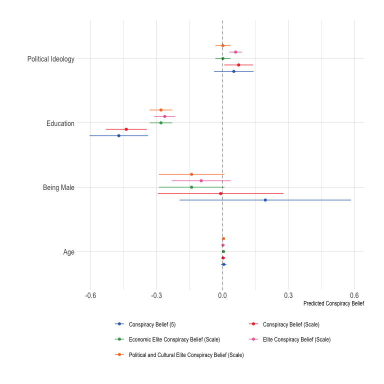
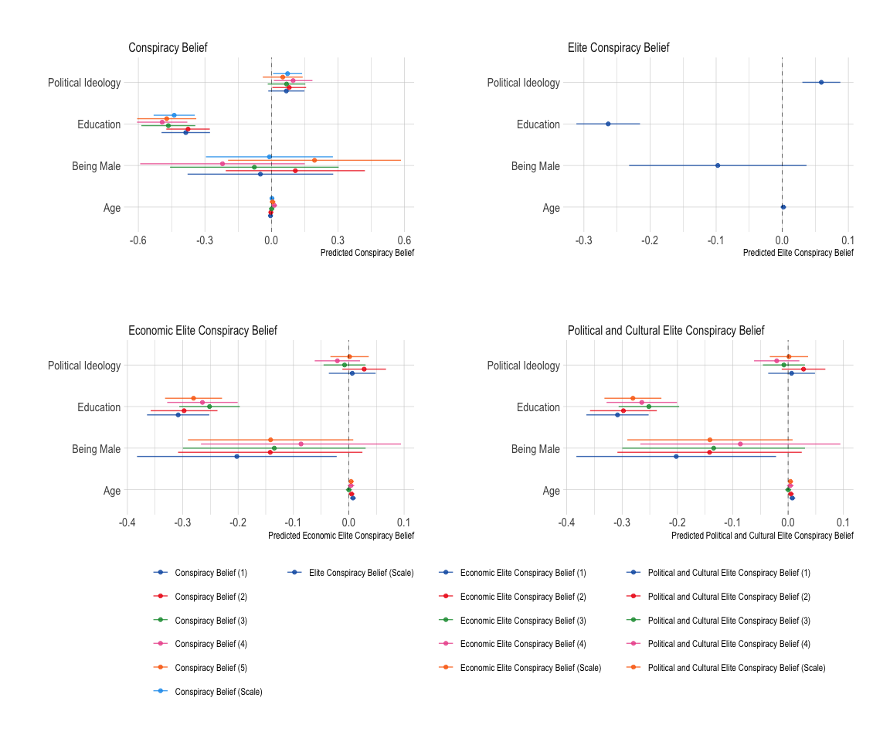
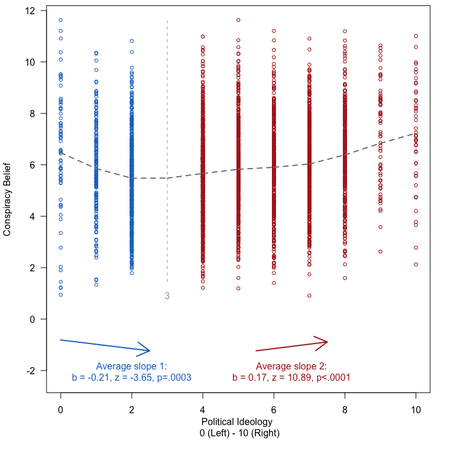
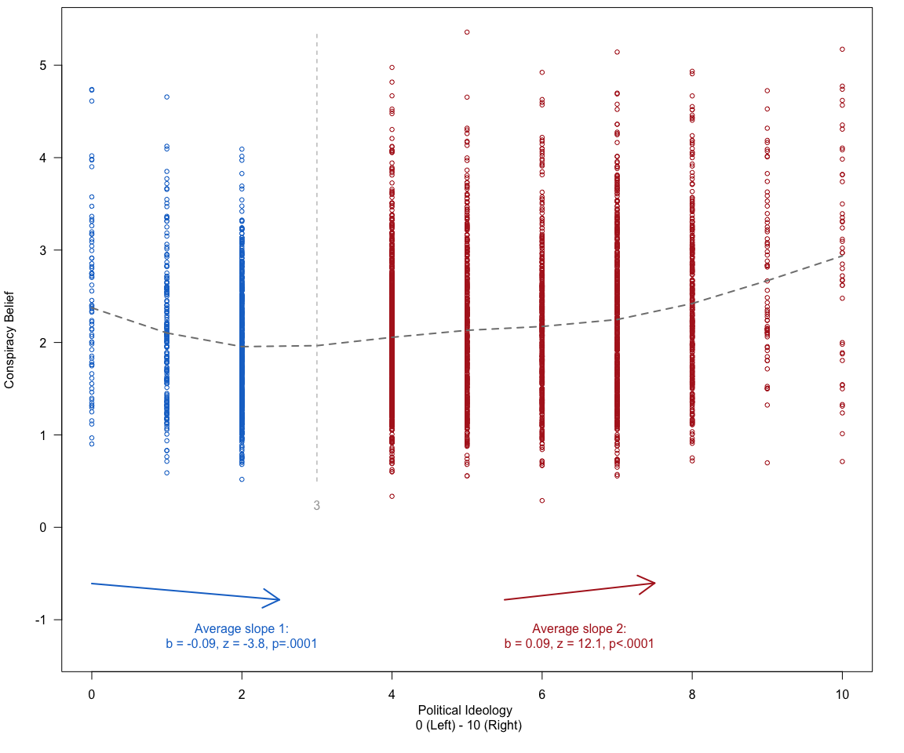

Analyses Study 1
================

# Scripts

# Required Packages & Reproducibility

``` r
rm(list=ls())
source(here::here("src/lib/functions.R"))
```

# Analyses

``` r
load(here("data/intermediate/s1.RData"))
dw <-d %>% 
  drop_na(weight)
dw <- svydesign(id=~1, weights=~weight, data=dw)
```

Next, we automatically extract a `.md` file for the online appendix, as
well as a latex table for the manuscript. We are using jinja2 template
[src/analysis/table_descriptives.tex.j2](table.tex.j2) which is called
with a json string containing the data. To replicate, make sure
`env/bin/pip install -U j2cli` is installed via your command line.

``` r
source(here("src/analysis/descr-overview-s1.R"))

kbl(descr, booktabs =T, caption = "Descriptives") %>%
  kable_styling(latex_options = c("striped", "hold_position"),
                full_width = F, fixed_thead = T, position = "center") %>%
  column_spec(1, width = "5cm") %>%
  column_spec(2, width = "2cm") %>%
  column_spec(3, width = "2cm") %>%
  column_spec(4, width = "2cm") %>%
  column_spec(5, width = "2cm")   
```

<table class="table" style="width: auto !important; margin-left: auto; margin-right: auto;">
<caption>
Descriptives
</caption>
<thead>
<tr>
<th style="text-align:left;position: sticky; top:0; background-color: #FFFFFF;">
Variables
</th>
<th style="text-align:right;position: sticky; top:0; background-color: #FFFFFF;">
Mean Value
</th>
<th style="text-align:right;position: sticky; top:0; background-color: #FFFFFF;">
St. Dev
</th>
<th style="text-align:right;position: sticky; top:0; background-color: #FFFFFF;">
Min. Value
</th>
<th style="text-align:right;position: sticky; top:0; background-color: #FFFFFF;">
Max. Value
</th>
</tr>
</thead>
<tbody>
<tr>
<td style="text-align:left;width: 5cm; ">
Age
</td>
<td style="text-align:right;width: 2cm; ">
59.7466120
</td>
<td style="text-align:right;width: 2cm; ">
13.9431502
</td>
<td style="text-align:right;width: 2cm; ">
18
</td>
<td style="text-align:right;width: 2cm; ">
93
</td>
</tr>
<tr>
<td style="text-align:left;width: 5cm; ">
DV: Conspiracy Belief (Scale)
</td>
<td style="text-align:right;width: 2cm; ">
5.8108773
</td>
<td style="text-align:right;width: 2cm; ">
1.8090875
</td>
<td style="text-align:right;width: 2cm; ">
1
</td>
<td style="text-align:right;width: 2cm; ">
11
</td>
</tr>
<tr>
<td style="text-align:left;width: 5cm; ">
DV: Conspiracy Belief (1)
</td>
<td style="text-align:right;width: 2cm; ">
6.9383024
</td>
<td style="text-align:right;width: 2cm; ">
2.2987443
</td>
<td style="text-align:right;width: 2cm; ">
1
</td>
<td style="text-align:right;width: 2cm; ">
11
</td>
</tr>
<tr>
<td style="text-align:left;width: 5cm; ">
DV: Conspiracy Belief (2)
</td>
<td style="text-align:right;width: 2cm; ">
6.6751070
</td>
<td style="text-align:right;width: 2cm; ">
2.1340841
</td>
<td style="text-align:right;width: 2cm; ">
1
</td>
<td style="text-align:right;width: 2cm; ">
11
</td>
</tr>
<tr>
<td style="text-align:left;width: 5cm; ">
DV: Conspiracy Belief (3)
</td>
<td style="text-align:right;width: 2cm; ">
4.6567404
</td>
<td style="text-align:right;width: 2cm; ">
2.2856562
</td>
<td style="text-align:right;width: 2cm; ">
1
</td>
<td style="text-align:right;width: 2cm; ">
11
</td>
</tr>
<tr>
<td style="text-align:left;width: 5cm; ">
DV: Conspiracy Belief (4)
</td>
<td style="text-align:right;width: 2cm; ">
4.9495364
</td>
<td style="text-align:right;width: 2cm; ">
2.2140140
</td>
<td style="text-align:right;width: 2cm; ">
1
</td>
<td style="text-align:right;width: 2cm; ">
11
</td>
</tr>
<tr>
<td style="text-align:left;width: 5cm; ">
DV: Conspiracy Belief (5)
</td>
<td style="text-align:right;width: 2cm; ">
5.8347004
</td>
<td style="text-align:right;width: 2cm; ">
2.4034696
</td>
<td style="text-align:right;width: 2cm; ">
1
</td>
<td style="text-align:right;width: 2cm; ">
11
</td>
</tr>
<tr>
<td style="text-align:left;width: 5cm; ">
Level of Education
</td>
<td style="text-align:right;width: 2cm; ">
5.7485735
</td>
<td style="text-align:right;width: 2cm; ">
1.2500393
</td>
<td style="text-align:right;width: 2cm; ">
1
</td>
<td style="text-align:right;width: 2cm; ">
7
</td>
</tr>
<tr>
<td style="text-align:left;width: 5cm; ">
Gender
</td>
<td style="text-align:right;width: 2cm; ">
0.7549929
</td>
<td style="text-align:right;width: 2cm; ">
0.4301298
</td>
<td style="text-align:right;width: 2cm; ">
0
</td>
<td style="text-align:right;width: 2cm; ">
1
</td>
</tr>
<tr>
<td style="text-align:left;width: 5cm; ">
Political Ideology
</td>
<td style="text-align:right;width: 2cm; ">
5.4693295
</td>
<td style="text-align:right;width: 2cm; ">
2.2411558
</td>
<td style="text-align:right;width: 2cm; ">
1
</td>
<td style="text-align:right;width: 2cm; ">
11
</td>
</tr>
</tbody>
</table>

``` r
rm(descr)
```

## H1: Both left and right political extremists are more likely to endorse conspiracy theories than political moderates

``` r
source(here("src/analysis/s1.R"))
p1
```



``` r
p2
```



``` r
tl <- twolines(cb ~ ideology + gender + age + education, data = df) 
```



``` r
p3
```


