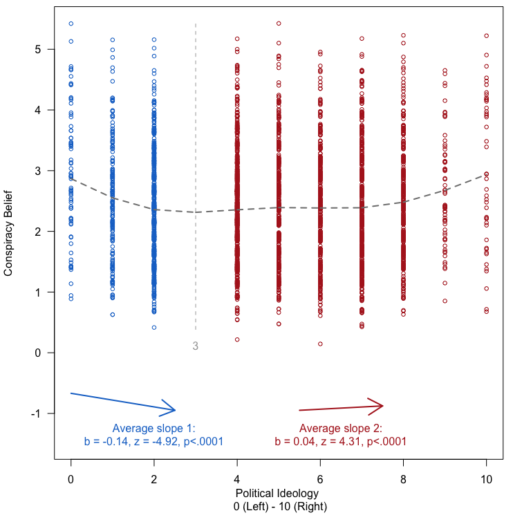
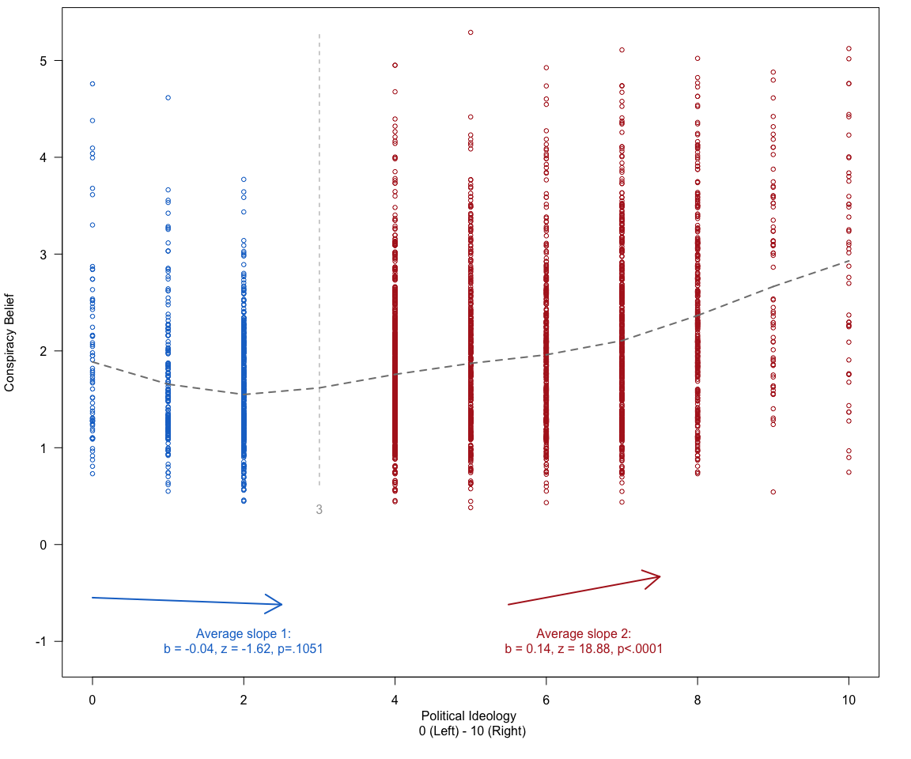
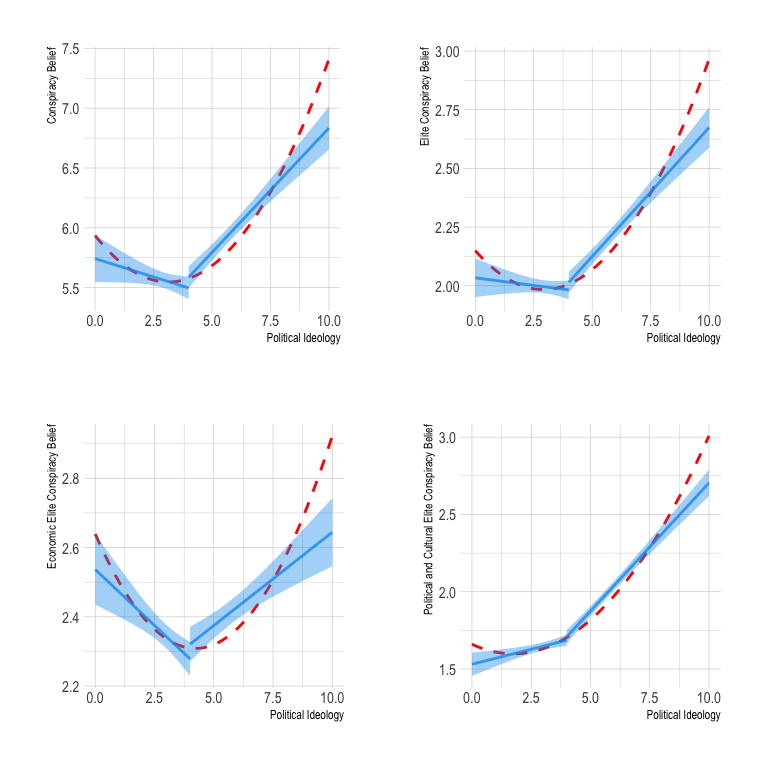

Analyses Study 2
================

# Scripts

# Required Packages & Reproducibility

``` r
rm(list=ls())
source(here::here("src/lib/functions.R"))
```

# Analyses

``` r
load(here("data/intermediate/s2.RData"))
dw <-d %>% 
  drop_na(weight)
dw <- svydesign(id=~1, weights=~weight, data=dw)
```

Next, we automatically extract a `.md` file for the online appendix, as
well as a latex table for the manuscript. We are using jinja2 template
[src/analysis/table_descriptives.tex.j2](table.tex.j2) which is called
with a json string containing the data. To replicate, make sure
`env/bin/pip install -U j2cli` is installed via your command line.

``` r
source(here("src/analysis/descr-overview-s2.R"))

kbl(descr, booktabs =T, caption = "Descriptives") %>%
  kable_styling(latex_options = c("striped", "hold_position"),
                full_width = F, fixed_thead = T, position = "center") %>%
  column_spec(1, width = "5cm") %>%
  column_spec(2, width = "2cm") %>%
  column_spec(3, width = "2cm") %>%
  column_spec(4, width = "2cm") %>%
  column_spec(5, width = "2cm")   
```

<table class="table" style="width: auto !important; margin-left: auto; margin-right: auto;">
<caption>
Descriptives
</caption>
<thead>
<tr>
<th style="text-align:left;position: sticky; top:0; background-color: #FFFFFF;">
Variables
</th>
<th style="text-align:right;position: sticky; top:0; background-color: #FFFFFF;">
Mean Value
</th>
<th style="text-align:right;position: sticky; top:0; background-color: #FFFFFF;">
St. Dev
</th>
<th style="text-align:right;position: sticky; top:0; background-color: #FFFFFF;">
Min. Value
</th>
<th style="text-align:right;position: sticky; top:0; background-color: #FFFFFF;">
Max. Value
</th>
</tr>
</thead>
<tbody>
<tr>
<td style="text-align:left;width: 5cm; ">
Age
</td>
<td style="text-align:right;width: 2cm; ">
44.2255300
</td>
<td style="text-align:right;width: 2cm; ">
14.5441794
</td>
<td style="text-align:right;width: 2cm; ">
5
</td>
<td style="text-align:right;width: 2cm; ">
80
</td>
</tr>
<tr>
<td style="text-align:left;width: 5cm; ">
DV: Conspiracy Belief (Scale)
</td>
<td style="text-align:right;width: 2cm; ">
5.7835814
</td>
<td style="text-align:right;width: 2cm; ">
1.8026076
</td>
<td style="text-align:right;width: 2cm; ">
1
</td>
<td style="text-align:right;width: 2cm; ">
11
</td>
</tr>
<tr>
<td style="text-align:left;width: 5cm; ">
DV: Conspiracy Belief (1)
</td>
<td style="text-align:right;width: 2cm; ">
7.0635995
</td>
<td style="text-align:right;width: 2cm; ">
2.3302784
</td>
<td style="text-align:right;width: 2cm; ">
1
</td>
<td style="text-align:right;width: 2cm; ">
11
</td>
</tr>
<tr>
<td style="text-align:left;width: 5cm; ">
DV: Conspiracy Belief (2)
</td>
<td style="text-align:right;width: 2cm; ">
6.8703203
</td>
<td style="text-align:right;width: 2cm; ">
2.0620005
</td>
<td style="text-align:right;width: 2cm; ">
1
</td>
<td style="text-align:right;width: 2cm; ">
11
</td>
</tr>
<tr>
<td style="text-align:left;width: 5cm; ">
DV: Conspiracy Belief (3)
</td>
<td style="text-align:right;width: 2cm; ">
4.7778530
</td>
<td style="text-align:right;width: 2cm; ">
2.2715586
</td>
<td style="text-align:right;width: 2cm; ">
1
</td>
<td style="text-align:right;width: 2cm; ">
11
</td>
</tr>
<tr>
<td style="text-align:left;width: 5cm; ">
DV: Conspiracy Belief (4)
</td>
<td style="text-align:right;width: 2cm; ">
4.6533604
</td>
<td style="text-align:right;width: 2cm; ">
2.1371968
</td>
<td style="text-align:right;width: 2cm; ">
1
</td>
<td style="text-align:right;width: 2cm; ">
11
</td>
</tr>
<tr>
<td style="text-align:left;width: 5cm; ">
DV: Conspiracy Belief (5)
</td>
<td style="text-align:right;width: 2cm; ">
5.5527740
</td>
<td style="text-align:right;width: 2cm; ">
2.4204068
</td>
<td style="text-align:right;width: 2cm; ">
1
</td>
<td style="text-align:right;width: 2cm; ">
11
</td>
</tr>
<tr>
<td style="text-align:left;width: 5cm; ">
NA
</td>
<td style="text-align:right;width: 2cm; ">
2.1072959
</td>
<td style="text-align:right;width: 2cm; ">
0.8230786
</td>
<td style="text-align:right;width: 2cm; ">
1
</td>
<td style="text-align:right;width: 2cm; ">
5
</td>
</tr>
<tr>
<td style="text-align:left;width: 5cm; ">
Economic Elite Conspiracy Belief (Scale)
</td>
<td style="text-align:right;width: 2cm; ">
2.3835138
</td>
<td style="text-align:right;width: 2cm; ">
0.9563812
</td>
<td style="text-align:right;width: 2cm; ">
1
</td>
<td style="text-align:right;width: 2cm; ">
5
</td>
</tr>
<tr>
<td style="text-align:left;width: 5cm; ">
Economic Elite Conspiracy Belief (1)
</td>
<td style="text-align:right;width: 2cm; ">
2.3096527
</td>
<td style="text-align:right;width: 2cm; ">
1.1526651
</td>
<td style="text-align:right;width: 2cm; ">
1
</td>
<td style="text-align:right;width: 2cm; ">
5
</td>
</tr>
<tr>
<td style="text-align:left;width: 5cm; ">
Economic Elite Conspiracy Belief (2)
</td>
<td style="text-align:right;width: 2cm; ">
2.0478124
</td>
<td style="text-align:right;width: 2cm; ">
1.0534833
</td>
<td style="text-align:right;width: 2cm; ">
1
</td>
<td style="text-align:right;width: 2cm; ">
5
</td>
</tr>
<tr>
<td style="text-align:left;width: 5cm; ">
Economic Elite Conspiracy Belief (3)
</td>
<td style="text-align:right;width: 2cm; ">
2.5342806
</td>
<td style="text-align:right;width: 2cm; ">
1.1210603
</td>
<td style="text-align:right;width: 2cm; ">
1
</td>
<td style="text-align:right;width: 2cm; ">
5
</td>
</tr>
<tr>
<td style="text-align:left;width: 5cm; ">
Economic Elite Conspiracy Belief (4)
</td>
<td style="text-align:right;width: 2cm; ">
2.6423094
</td>
<td style="text-align:right;width: 2cm; ">
1.1591886
</td>
<td style="text-align:right;width: 2cm; ">
1
</td>
<td style="text-align:right;width: 2cm; ">
5
</td>
</tr>
<tr>
<td style="text-align:left;width: 5cm; ">
Political and Cultural Elite Conspiracy Belief (Scale)
</td>
<td style="text-align:right;width: 2cm; ">
1.8310780
</td>
<td style="text-align:right;width: 2cm; ">
0.8209936
</td>
<td style="text-align:right;width: 2cm; ">
1
</td>
<td style="text-align:right;width: 2cm; ">
5
</td>
</tr>
<tr>
<td style="text-align:left;width: 5cm; ">
Political and Cultural Elite Conspiracy Belief (1)
</td>
<td style="text-align:right;width: 2cm; ">
1.8912945
</td>
<td style="text-align:right;width: 2cm; ">
1.1172624
</td>
<td style="text-align:right;width: 2cm; ">
1
</td>
<td style="text-align:right;width: 2cm; ">
5
</td>
</tr>
<tr>
<td style="text-align:left;width: 5cm; ">
Political and Cultural Elite Conspiracy Belief (2)
</td>
<td style="text-align:right;width: 2cm; ">
1.8495715
</td>
<td style="text-align:right;width: 2cm; ">
1.0089453
</td>
<td style="text-align:right;width: 2cm; ">
1
</td>
<td style="text-align:right;width: 2cm; ">
5
</td>
</tr>
<tr>
<td style="text-align:left;width: 5cm; ">
Political and Cultural Elite Conspiracy Belief (3)
</td>
<td style="text-align:right;width: 2cm; ">
1.5780334
</td>
<td style="text-align:right;width: 2cm; ">
0.8671643
</td>
<td style="text-align:right;width: 2cm; ">
1
</td>
<td style="text-align:right;width: 2cm; ">
5
</td>
</tr>
<tr>
<td style="text-align:left;width: 5cm; ">
Political and Cultural Elite Conspiracy Belief (4)
</td>
<td style="text-align:right;width: 2cm; ">
2.0054127
</td>
<td style="text-align:right;width: 2cm; ">
1.0157645
</td>
<td style="text-align:right;width: 2cm; ">
1
</td>
<td style="text-align:right;width: 2cm; ">
5
</td>
</tr>
<tr>
<td style="text-align:left;width: 5cm; ">
Level of Education
</td>
<td style="text-align:right;width: 2cm; ">
5.6037438
</td>
<td style="text-align:right;width: 2cm; ">
1.2980036
</td>
<td style="text-align:right;width: 2cm; ">
1
</td>
<td style="text-align:right;width: 2cm; ">
7
</td>
</tr>
<tr>
<td style="text-align:left;width: 5cm; ">
Gender
</td>
<td style="text-align:right;width: 2cm; ">
0.6986919
</td>
<td style="text-align:right;width: 2cm; ">
0.4588780
</td>
<td style="text-align:right;width: 2cm; ">
0
</td>
<td style="text-align:right;width: 2cm; ">
1
</td>
</tr>
<tr>
<td style="text-align:left;width: 5cm; ">
Political Ideology
</td>
<td style="text-align:right;width: 2cm; ">
4.4666216
</td>
<td style="text-align:right;width: 2cm; ">
2.1548219
</td>
<td style="text-align:right;width: 2cm; ">
0
</td>
<td style="text-align:right;width: 2cm; ">
10
</td>
</tr>
</tbody>
</table>

``` r
rm(descr)
```

## H2: The political left is more likely to endorse conspiracy theories involving economic elites, while the political right is more likely to endorse conspiracy theories involving political and cultural elites

``` r
source(here("src/analysis/s2.R"))

p1
```


``` r
(p2a +p2b)/(p2c + p2d) +
  plot_layout(guides = 'collect') &
  theme(legend.position = 'bottom',
        legend.direction = 'vertical')
```


``` r
tl1 <- twolines(cb ~ ideology + gender + age + education, data = df)
```


``` r
tl2 <- twolines(cbs ~ ideology + gender + age + education, data = df)
```


``` r
tl3 <- twolines(cl ~ ideology + gender + age + education, data = df)
```



``` r
tl4 <- twolines(cr ~ ideology + gender + age + education, data = df)
```



``` r
(p3a +p3b)/(p3c + p3d) 
```


